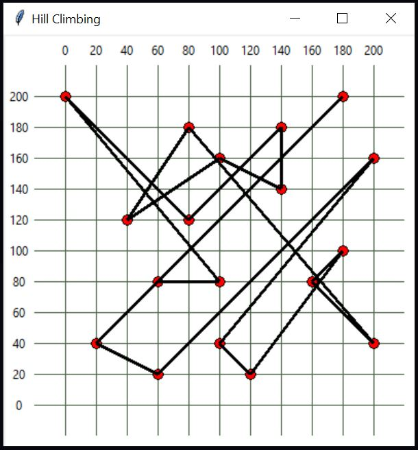
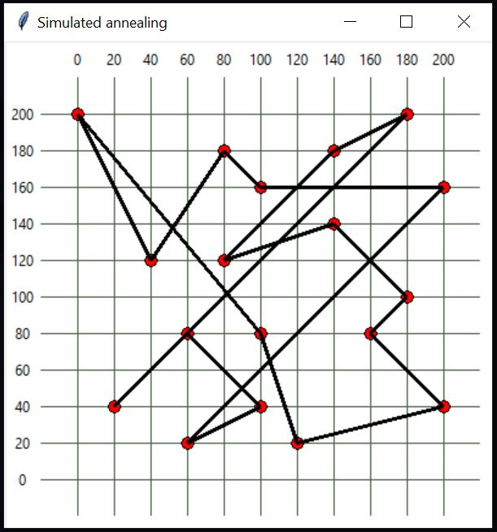

# Optimization-Search-Python
A collection of python scripts that demonstrate solving the travelling salesman problem. Simulated annealing an hill climbing is used to solve the optimization problem

# Screenshots
## Hill Climbing

## Simulated Annealing


# How to run
The application can be run with python

## Running Hill Climbing
```console
foo@bar:~$ python hill-climbing.py
```
## Running Simulated Annealing
```console
foo@bar:~$ python simulated-annealing.py
```